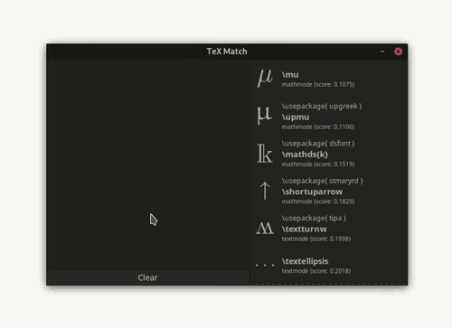
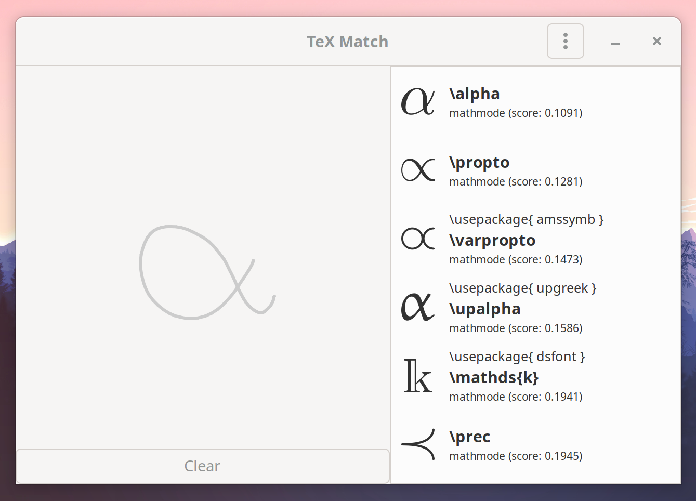
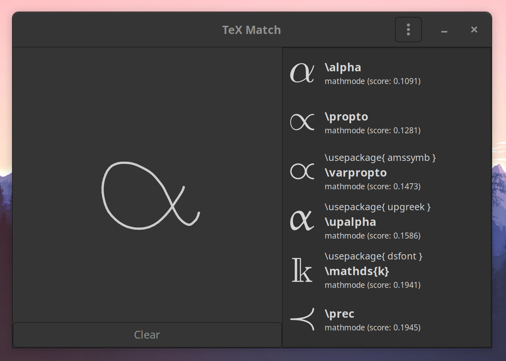

<p align="center">
  
</p>

<div align="center">
  
</div>

<h1 align="center">TeX Match</h1>
<h3 align="center">Find LaTeX symbols by sketching. A desktop version of <a href="https://detexify.kirelabs.org/classify.html">detexify</a></h3>
<p align="center"><i>Also checkout <a href="https://github.com/zoeyfyi/Boop-GTK">Boop-GTK</a>: A scriptable scratchpad for developers</i></p>


<p align="center">
  <a href="#what-is-tex-match">What is TeX-Match?</a> • <a href="#features">Features</a> • <a href="#downloads">Downloads</a> • <a href="#screenshots">Screenshots</a> • <a href="#building">Building</a>
</p>

<br>


[](https://crates.io/crates/tex-match)
[](https://snapcraft.io/tex-match)
[](https://flathub.org/apps/details/fyi.zoey.TeX-Match)


### What is TeX Match?

If you work with LaTeX, you know its difficult to memorize the names of all the symbols. TeX Match allows you to search through over 1000 different LaTeX symbols by sketching. Once you found the desired symbol you can copy it to the clipboard by clicking on the entry. TeX Match is based of [detexify](https://detexify.kirelabs.org/classify.html) and is powered by a port of the [detexify classifier](https://github.com/zoeyfyi/detexify-rust).

### Features

- Over 1000 LaTeX symbols across multiple packages (same set as detexify) 
- Completely offline
- Crossplatform

### Downloads

| Platform | Format | Link | 
| -------- | ------ | ---- | 
| Linux | Binary | [tex-match.linux.amd64](https://github.com/zoeyfyi/TeX-Match/releases/latest/download/tex-match.linux.amd64) | 
| | Flatpak | [tex-match.flatpak](https://github.com/zoeyfyi/TeX-Match/releases/latest/download/tex-match.flatpak) | 
| | Snap | [tex-match.snap](https://github.com/zoeyfyi/TeX-Match/releases/latest/download/tex-match.snap) | 
| | AUR | [`tex-match`](https://aur.archlinux.org/packages/tex-match/) </br> [`tex-match-bin`](https://aur.archlinux.org/packages/tex-match-bin/)  |
| | Snap Store | [](https://snapcraft.io/tex-match) | 
| | Flathub | [](https://flathub.org/apps/details/fyi.zoey.TeX-Match) | 
| Windows | Installer | [tex-match.windows.msi](https://github.com/zoeyfyi/TeX-Match/releases/latest/download/tex-match.windows.msi) | 
| MacOS | Binary | You should really use the [detexify Mac app](https://gum.co/detexify), but if you _really__ want to: [tex-match.macos](https://github.com/zoeyfyi/TeX-Match/releases/latest/download/tex-match.macos) |

### Screenshots

| Adwaita | Adwaita-Dark |
| :---: | :---: |
|  |  |


### Building

#### Linux

```shell
sudo apt-get install -y libgtk-3-dev
cargo build
```

#### Linux Snap

```shell
sudo apt-get install snap snapcraft
snapcraft snap
sudo snap install tex-match_1.1.0_amd64.snap
```

#### Linux Flatpak

```shell
sudo add-apt-repository ppa:alexlarsson/flatpak 
sudo apt-get update 
sudo apt-get install flatpak
sudo flatpak remote-add --if-not-exists flathub https://dl.flathub.org/repo/flathub.flatpakrepo
sudo flatpak install -y flathub org.freedesktop.Platform//20.08 org.freedesktop.Sdk//20.08 org.freedesktop.Sdk.Extension.rust-stable//20.08
wget https://github.com/flatpak/flatpak-builder/releases/download/1.0.10/flatpak-builder-1.0.10.tar.xz && tar -xvf flatpak-builder-1.0.10.tar.xz && cd flatpak-builder-1.0.10 && ./configure --disable-documentation && make && sudo make install
sudo apt-get install python3-toml
bash flatpak/gen-sources.sh
flatpak-builder --repo=repo build-dir flatpak/fyi.zoey.TeX-Match.json
flatpak build-bundle ./repo tex-match.flatpak fyi.zoey.TeX-Match
```

#### MacOS

```shell
brew install gtk+3
cargo build
```

#### Windows

```powershell
git clone https://github.com/wingtk/gvsbuild.git C:\gtk-build\github\gvsbuild
cd C:\gtk-build\github\gvsbuild; python .\build.py build -p=x64 --vs-ver=16 --msys-dir=C:\msys64 -k --enable-gi --py-wheel --py-egg gtk3 gdk-pixbuf
cargo build
```

#### Windows Installer

```powershell
# follow build steps above, then:
cargo install cargo-wix 
cargo wix -v
```
